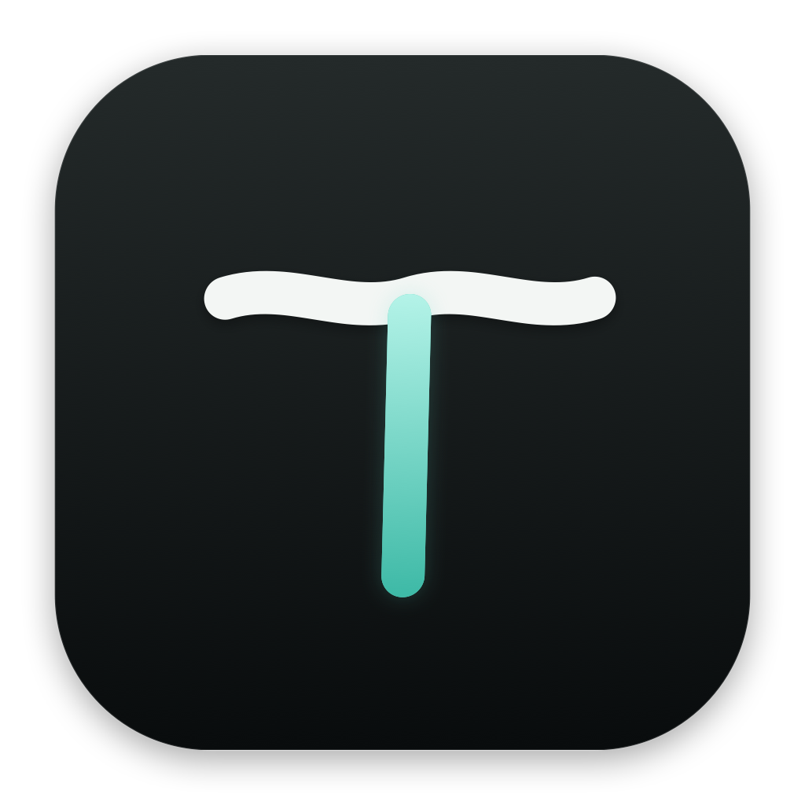
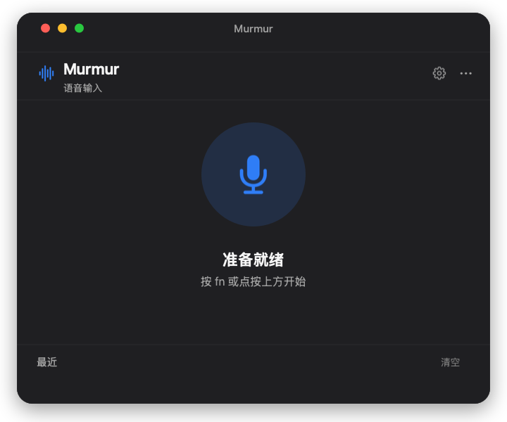
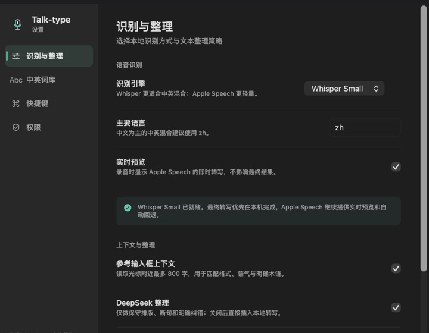

<div align="center">



# Talk-type

面向 macOS 的 **AI 语音输入工具**


[中文](#中文) · [English](#english)

</div>

<p align="center">
  
</p>

## 中文

### 简介

Talk-type 是一款面向 macOS 的 **AI 语音输入工具**，支持中文和中英文混合识别，并利用 AI 完成标点、断句、格式匹配和必要的文本整理。它还提供个人词库、实时预览和上下文识别。

### 特点

- **中英混合识别**：更好地处理英文名称、产品名和专业词汇。
- **AI 文本整理**：调整标点、断句和段落，同时保留原意，不回答问题，不随意删改内容。
- **匹配上下文**：沿用已有文字的格式、语气和大小写，句中补词不会添加多余句号。
- **本地优先**：语音可以在本机识别，录音处理完成后自动删除。
- **使用轻便**：支持全局快捷键、菜单栏操作、最近记录和剪贴板备用。

<p align="center">
  
</p>

<p align="center"><sub>识别方式、实时预览、上下文和文本整理均可单独设置。</sub></p>

### 隐私

- Whisper Small 可以在本机完成语音识别。
- 临时录音会在本次处理结束后删除。
- AI 文本整理可以关闭；开启时只发送文字和可选的光标上下文，不发送音频。
- API Key 保存在 macOS 钥匙串中。
- 最近记录保存在本机，可以随时清空。

### 使用要求

- macOS 14 或更高版本。
- 麦克风权限用于录音。
- 辅助功能权限用于全局快捷键、读取可选上下文和自动输入文字。
- 本地 Whisper 识别需要另外安装 `whisper-cli` 和 Whisper Small 模型。

<details>
<summary><strong>安装 Whisper Small</strong></summary>

Talk-type 会在以下位置查找 `whisper-cli`：

```text
/opt/homebrew/bin/whisper-cli
/usr/local/bin/whisper-cli
```

模型文件名应为 `ggml-small.bin`，推荐放在：

```text
~/Library/Application Support/Talk-type/Models/ggml-small.bin
```

旧版本使用过的路径仍然兼容：

```text
~/Library/Application Support/Murmur/Models/ggml-small.bin
```

Whisper Small 模型约 465 MB。没有安装模型时，Talk-type 会使用 Apple Speech 完成识别。

</details>

<details>
<summary><strong>从源码构建</strong></summary>

```bash
git clone https://github.com/cyx2333hhh/talk-type.git
cd talk-type
open Murmur.xcodeproj
```

在 Xcode 中选择 `Murmur` target，并设置自己的 Development Team。跨 App 读取和输入文字需要保持 App Sandbox 关闭。

无签名命令行构建：

```bash
xcodebuild -project Murmur.xcodeproj -target Murmur CODE_SIGNING_ALLOWED=NO build
```

构建产物位于 `build/Release/Talk-type.app`，同时支持 Apple Silicon 和 Intel Mac。

</details>

---

## English

Talk-type is an **AI voice input tool for macOS** with Chinese and mixed Chinese-English recognition. It provides optional AI cleanup for punctuation, sentence breaks, formatting, and clear transcription errors, while keeping the original meaning intact.

### Highlights

- **Mixed Chinese and English**: Better handling of English names, products, and technical terms.
- **Conservative AI cleanup**: Improves punctuation and formatting without answering questions or freely rewriting dictated content.
- **Context matching**: Follows the surrounding format, tone, casing, and punctuation, including inline text insertion.
- **Local first**: Whisper Small can run on the Mac, and temporary recordings are deleted after processing.
- **Lightweight workflow**: Global shortcut, menu bar controls, live preview, recent history, and clipboard fallback.

### Privacy

Local Whisper recognition does not upload audio. Optional AI cleanup receives text and optional cursor context only when enabled; audio is never sent with that request. API keys are stored in the macOS Keychain, and recent results remain on the Mac.

### Requirements

Talk-type requires macOS 14 or later. Microphone permission is used for recording, while Accessibility permission enables the global shortcut, optional cursor context, and automatic text insertion. Local recognition requires `whisper-cli` and the Whisper Small model described above.

---

## License

Talk-type is released under the [MIT License](LICENSE).
