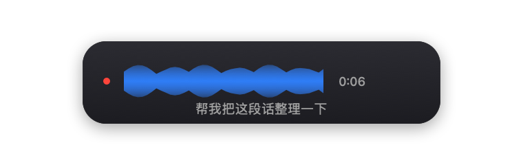

<div align="center">


# Murmur

**Minimal voice‑to‑text for macOS — press a key, speak, and your words land at the cursor.**

**简约的 Mac 语音输入 —— 按一下、说话，文字自动落到当前光标处。**


[English](#english) · [中文](#中文)

<br/>




</div>

---

## English

Murmur lives in your menu bar and Dock. Press a hotkey, speak, press it again — Murmur transcribes your speech **on-device** with local Whisper Small when installed (Apple Speech is the fallback) and, if you add a DeepSeek key, **tidies it up** before inserting it wherever your cursor is.

No subscription, no account required, and your **audio never leaves your Mac**.

### Features

- 🎙️ **On-device transcription** — local Whisper Small is preferred for mixed Chinese/English; Apple `SFSpeechRecognizer` provides live preview and automatic fallback. No API key is required.
- 🧩 **Context-aware dictation** — optionally reads up to 800 characters around the cursor to match formatting, tone and terminology. The context is held only for the current dictation.
- ✨ **Optional AI cleanup** — add a [DeepSeek](https://platform.deepseek.com) key to auto‑punctuate, paragraph, de‑filler and fix expression. The key is **optional** and stored only in the macOS Keychain.
- ⌨️ **Global hotkey** — default is the **fn / 🌐** key; tap to start, tap to stop. Re‑bindable to any shortcut.
- 📋 **Inserts at the cursor** — auto‑pastes into any app, with a one‑tap **Copy** fallback when a paste lands in the wrong place.
- 🪟 **Real UI** — menu‑bar popover **and** a main window with a Dock icon (so it's reachable even when the menu bar is crowded behind the notch).
- 〰️ **Live preview + flowing waveform** — see words appear as you speak, in a small, refined frosted pill.
- 🕘 **Recent history** — your last dictations, each copyable.
- 🔒 **Privacy-first** — audio stays local. If DeepSeek cleanup is enabled, the transcript and optional cursor context are sent for that request; both context capture and cleanup can be disabled.

### Requirements

- macOS 14 (Sonoma) or later
- Xcode 16+ to build
- *(recommended for mixed Chinese/English)* `whisper-cli` from whisper.cpp plus `ggml-small.bin` at `~/Library/Application Support/Murmur/Models/ggml-small.bin`
- *(optional)* a DeepSeek API key for the cleanup pass

### Build & run

```bash
git clone https://github.com/cyx2333hhh/murmur-mac.git
cd murmur-mac
open Murmur.xcodeproj
```

In Xcode, select the **Murmur** target → *Signing & Capabilities* → set your own **Team**, then press ⌘R. Keep **App Sandbox off** (it's off by default — pasting into other apps needs that).

Command‑line build:

```bash
xcodebuild -project Murmur.xcodeproj -target Murmur -configuration Debug build
# or, without signing:
xcodebuild -project Murmur.xcodeproj -target Murmur CODE_SIGNING_ALLOWED=NO build
```

### First‑time setup

1. **DeepSeek API Key (optional)** — Settings → leave empty to use local recognition only, or paste `sk-…` to enable cleanup.
2. **Permissions** — grant **Microphone**, **Speech Recognition**, and **Accessibility** (Accessibility powers auto‑paste; without it the result is copied to the clipboard for you to paste manually).
3. **Hotkey** — fn is the default. Global fn triggering needs Accessibility. If pressing fn opens the emoji picker, set *System Settings → Keyboard → "Press 🌐 key to" → Do Nothing*.

### Usage

Put your cursor in any text field → press **fn** → speak → press **fn** again. The text is transcribed, optionally cleaned up, and inserted at the cursor.

### How it works

```
fn / record button → record (.wav) → local Whisper Small
                                    → Apple Speech fallback + live preview
                                    → [optional] DeepSeek tidy-up with cursor context
                                    → clipboard + synthesized ⌘V → restore clipboard
```

### Tech

Native SwiftUI + AppKit. Final local transcription prefers whisper.cpp with Whisper Small; `SFSpeechRecognizer` powers live preview and fallback. Text cleanup uses DeepSeek's OpenAI-compatible chat API. The app icon and menu-bar glyphs are generated programmatically with CoreGraphics — edit `Murmur-icongen.swift` and run `swift Murmur-icongen.swift` to regenerate.

---

## 中文

Murmur 常驻菜单栏和 Dock。按一下快捷键、说话、再按一下 —— Murmur 优先用本地 Whisper Small 把语音转成文字(Apple Speech 自动回退);如果你填了 DeepSeek 密钥,它还会自动整理后插入到光标位置。

无需订阅、无需账号,而且**音频不会离开你的 Mac**。

### 功能

- 🎙️ **本地转写** —— 中英混合优先使用本地 Whisper Small;苹果 `SFSpeechRecognizer` 负责实时预览和自动回退。**不填任何 Key 也能直接用。**
- 🧩 **上下文感知** —— 可读取光标前后最多 800 字,匹配既有格式、语气和术语;上下文只保留到本次输入结束。
- ✨ **可选 AI 整理** —— 填入 [DeepSeek](https://platform.deepseek.com) 密钥即可自动断句、分段、去口水词、纠正表达。密钥**可选**,且只存在系统钥匙串里。
- ⌨️ **全局快捷键** —— 默认 **fn / 🌐** 键,按一下开始、再按一下停止;可改成任意组合键。
- 📋 **插入到光标处** —— 自动粘贴进任何 App;万一落点不准,还有一键**复制**兜底。
- 🪟 **真正的界面** —— 菜单栏弹窗 **+** 带 Dock 图标的主窗口(刘海屏菜单栏被挤满时也找得到)。
- 〰️ **实时预览 + 流动声纹** —— 边说边出字,配小巧克制的毛玻璃胶囊。
- 🕘 **最近记录** —— 保留最近的转写结果,每条都能复制。
- 🔒 **隐私优先** —— 音频只在本地。启用 DeepSeek 整理时,本次转写和可选的光标上下文会随请求发送;上下文读取和 DeepSeek 均可关闭。

### 环境要求

- macOS 14(Sonoma)及以上
- 构建需 Xcode 16+
- *(推荐用于中英混合)* 安装 whisper.cpp 的 `whisper-cli`,并把 `ggml-small.bin` 放在 `~/Library/Application Support/Murmur/Models/ggml-small.bin`
- *(可选)* DeepSeek API 密钥(用于整理环节)

### 构建与运行

```bash
git clone https://github.com/cyx2333hhh/murmur-mac.git
cd murmur-mac
open Murmur.xcodeproj
```

在 Xcode 选中 **Murmur** target → *Signing & Capabilities* → 换成**你自己的 Team**,然后 ⌘R 运行。保持 **App Sandbox 关闭**(默认即关闭 —— 粘贴到其它 App 需要这一点)。

命令行构建:

```bash
xcodebuild -project Murmur.xcodeproj -target Murmur -configuration Debug build
# 或不签名:
xcodebuild -project Murmur.xcodeproj -target Murmur CODE_SIGNING_ALLOWED=NO build
```

### 首次设置

1. **DeepSeek API Key(可选)** —— 设置里留空则只用本地识别;填入 `sk-…` 则启用整理。
2. **权限** —— 授权**麦克风**、**语音识别**、**辅助功能**(辅助功能用于自动粘贴;没授权时结果会复制到剪贴板,手动 ⌘V 即可)。
3. **快捷键** —— 默认 fn。fn 全局触发需要辅助功能权限。若按 fn 会弹出表情面板,去 *系统设置 → 键盘 → "按 🌐 键时" → 无操作*。

### 使用

把光标放进任意输入框 → 按 **fn** → 说话 → 再按 **fn**。文字会被转写、(可选)整理,并插入到光标处。

### 工作原理

```
fn / 录音按钮 → 录音(.wav) → 本地 Whisper Small
                            → Apple Speech 回退 + 实时预览
                            → (可选)结合光标上下文的 DeepSeek 整理
                            → 写入剪贴板 + 模拟 ⌘V → 还原剪贴板
```

### 技术

原生 SwiftUI + AppKit。最终转写优先使用 whisper.cpp + Whisper Small;`SFSpeechRecognizer` 负责实时预览与回退;文本整理使用 DeepSeek 的 OpenAI 兼容对话 API。App 图标与菜单栏图标由 CoreGraphics 脚本程序化生成 —— 改 `Murmur-icongen.swift` 后跑 `swift Murmur-icongen.swift` 即可重新生成。

### 许可证

[MIT](LICENSE) 许可证开源。

---

## License

Released under the [MIT](LICENSE) License.

---

<div align="center">
<sub>Built with ❤️ on macOS · 用 ❤️ 在 macOS 上打造</sub>
</div>
